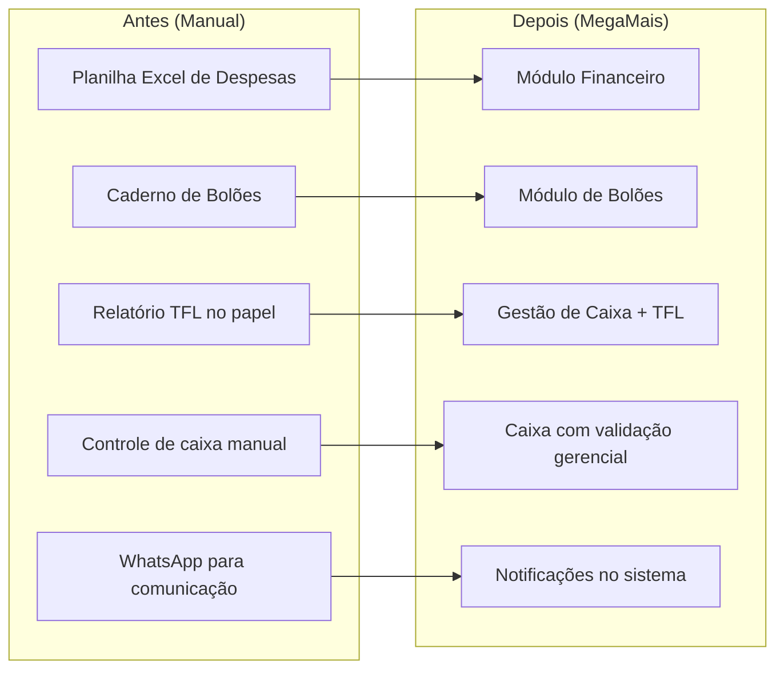
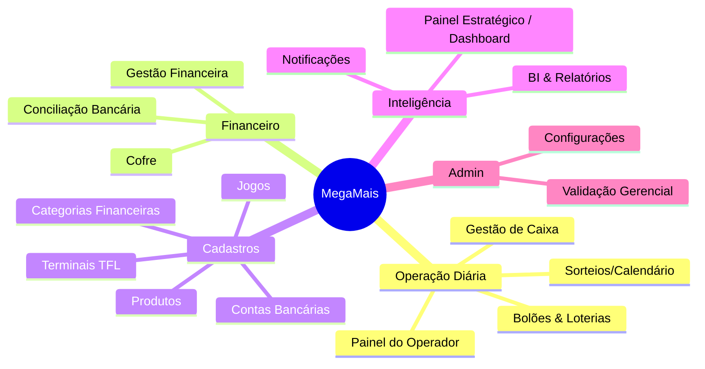

# 🎯 MegaMais — Visão Geral do Sistema

> **Versão:** Beta v2.5.22 | **Data:** Fevereiro 2026 | **Plataforma:** Web (SaaS)

## O que é o MegaMais?

O MegaMais é um **sistema de gestão completo para casas lotéricas**, construído como aplicação web moderna. Ele nasceu para **substituir as planilhas do Excel, cadernos e controles manuais** por uma plataforma unificada, acessível de qualquer navegador.

## 🧠 Filosofia: "Excel Turbo"

A filosofia central do MegaMais é ser um **"Excel Turbo"** — ou seja:

| Planilha Hoje | MegaMais (Excel Turbo) |
|---|---|
| Dados em arquivos .xlsx soltos, sem controle | Tudo centralizado em banco de dados seguro |
| Cada filial tem sua planilha separada | Visão multi-filial consolidada automaticamente |
| Cálculos manuais (fórmulas quebram) | Cálculos automáticos, consistentes e auditáveis |
| Sem histórico de quem alterou o quê | Auditoria completa (quem criou, editou, quando) |
| Risco de perda de dados (HD, nuvem pessoal) | Backup automático, dados na nuvem com segurança |
| Controle de bolão no papel/caderno | Módulo digital com cotas, vendas e acerto de operador |
| Fechamento de caixa no papel | Fechamento digital com comparação automática TFL |
| Sem controle de acesso (qualquer um edita tudo) | Permissões por papel: admin, gerente, operador |

### Princípios-chave:
1. **Controle manual, mas inteligente** — O gestor lança os dados (como no Excel), mas o sistema calcula, organiza e protege
2. **Sem automação mágica** — Nada é gerado automaticamente sem o gestor pedir. O usuário é dono dos dados
3. **Replicar Mês** — Em vez de gerar despesas fixas automaticamente, o gestor copia o mês anterior com um clique e ajusta valores
4. **Catálogo inteligente** — Categorias financeiras servem como autocomplete: ao digitar "Alu...", o sistema sugere "Aluguel" com valor e modalidade padrão

## Para quem é?

| Perfil | Acesso | O que faz no dia a dia |
|---|---|---|
| **Administrador/Diretor** | Total (todas as filiais) | Dashboard estratégico, financeiro completo, relatórios, gestão |
| **Gerente** | Sua filial | Financeiro da filial, cofre, conciliação, validar caixas |
| **Operador** | Apenas seu caixa | Abrir/fechar caixa, vender bolões, registrar movimentações |

## O que o sistema substitui?

## Módulos disponíveis (15 módulos)

## Filiais ativas

O sistema opera em modo **multi-tenant** — cada filial é uma unidade separada, mas o administrador vê tudo consolidado.

| Filial | Status | Dados desde |
|---|---|---|
| Natureza | ✅ Operacional | Janeiro/2026 |
| Aririzal | ✅ Operacional | Janeiro/2026 |

## Acesso ao sistema

O login é feito via **email + senha**, com autenticação gerenciada pelo Supabase Auth. Cada usuário tem um perfil vinculado a uma filial e um papel (role). Após o login, o sistema redireciona para o dashboard ou painel do operador conforme a role.

## Resumo em uma frase

> **MegaMais = "Excel Turbo" para lotéricas** — tudo o que você faz em planilhas, mas com segurança, multifilial, auditoria e inteligência.
