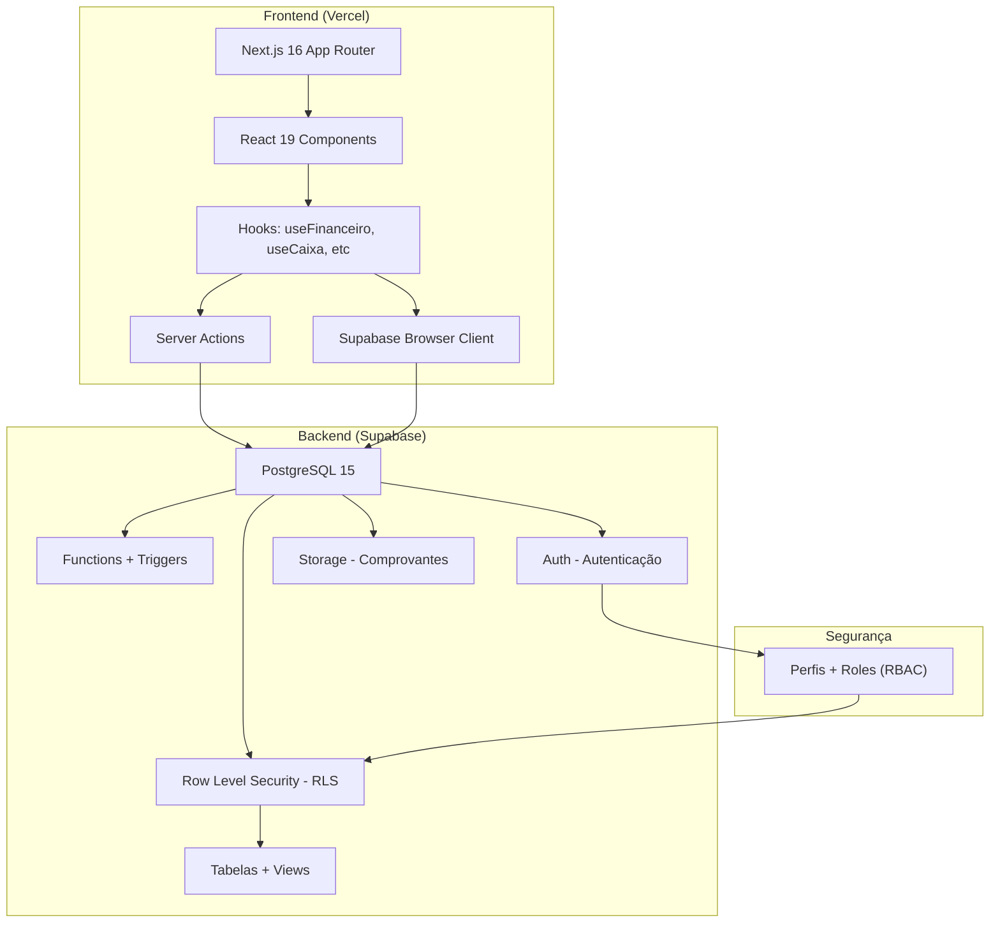
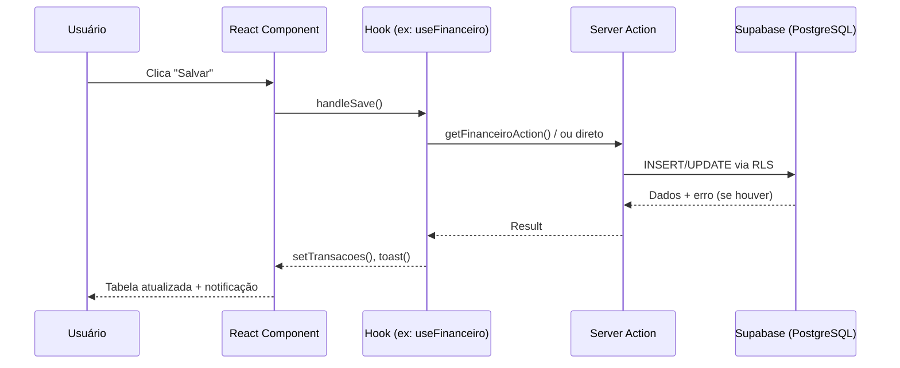

# 🏗️ Arquitetura Técnica — MegaMais

## Stack Tecnológica

| Camada | Tecnologia | Versão | Função |
|---|---|---|---|
| **Framework** | Next.js | 16.1.5 | Renderização, roteamento, Server Actions |
| **UI Library** | React | 19.2.3 | Componentização, estado reativo |
| **Linguagem** | TypeScript | 5.x | Tipagem forte, menos bugs |
| **Estilização** | TailwindCSS | 4.x | CSS utilitário, dark mode nativo |
| **Backend/DB** | Supabase | 2.93.1 | PostgreSQL, Auth, Storage, RLS |
| **Gráficos** | Recharts | 3.7.0 | KPIs, evolução mensal, barras |
| **Animações** | Framer Motion | 12.30.0 | Transições, micro-animações |
| **Ícones** | Lucide React | 0.563 | Ícones SVG modernos |
| **Validação** | Zod | 4.3.6 | Validação de schemas |
| **Deploy** | Vercel | — | Deploy automático via Git push |

## Diagrama de Arquitetura



## Fluxo de dados: Frontend → Backend



## Estrutura de pastas

```
megab_next/
├── src/
│   ├── app/                    # Páginas (Next.js App Router)
│   │   ├── (dashboard)/        # Grupo protegido (layout com sidebar)
│   │   │   ├── page.tsx        # Dashboard/Painel Estratégico
│   │   │   ├── boloes/         
│   │   │   ├── caixa/          
│   │   │   ├── financeiro/     
│   │   │   ├── cadastros/      # Sub-rotas: categorias, contas, jogos...
│   │   │   ├── cofre/          
│   │   │   ├── conciliacao/    
│   │   │   └── ...             
│   │   └── login/              # Página de autenticação
│   ├── components/             # Componentes React (55 arquivos)
│   │   ├── financeiro/         # 8 componentes financeiros
│   │   ├── caixa/              # 9 componentes de caixa
│   │   ├── boloes/             # 7 componentes de bolões
│   │   └── ui/                 # 13 componentes genéricos
│   ├── hooks/                  # 15 hooks de lógica de negócio
│   ├── contexts/               # 6 contextos globais
│   ├── actions/                # 9 Server Actions
│   ├── lib/                    # Clientes Supabase, constantes, validadores
│   └── types/                  # Tipos TypeScript
├── supabase/
│   └── migrations/             # 40+ scripts SQL de evolução
└── docs/                       # Esta documentação
```

## Segurança: RBAC + RLS

O sistema usa **duas camadas de segurança**:

### 1. Frontend (RBAC — Role-Based Access Control)
- Sidebar mostra/esconde itens baseado na `role` do usuário
- Roles: `admin`, `gerente`, `operador`
- Definido no hook `usePerfil` / tabela `perfis`

### 2. Banco de Dados (RLS — Row Level Security)
- Cada tabela tem policies que filtram dados por `loja_id`
- Funções auxiliares: `is_master()`, `get_my_loja_id()`, `is_admin()`
- O admin (master) vê tudo; operadores veem apenas sua filial

> **Exemplo de policy:**
> ```sql
> CREATE POLICY "financeiro_contas_access" ON financeiro_contas
>     FOR ALL TO authenticated
>     USING (is_master() OR loja_id = get_my_loja_id())
>     WITH CHECK (is_master() OR loja_id = get_my_loja_id());
> ```

## Deploy e Ambientes

| Ambiente | URL | Trigger |
|---|---|---|
| **Produção** | mega-mais.vercel.app (ou domínio personalizado) | Push na branch `main` |
| **Preview** | mega-mais-xyz.vercel.app | Pull Request ou push |
| **Banco** | Supabase Cloud | Migrations manuais via Dashboard |
