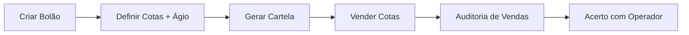
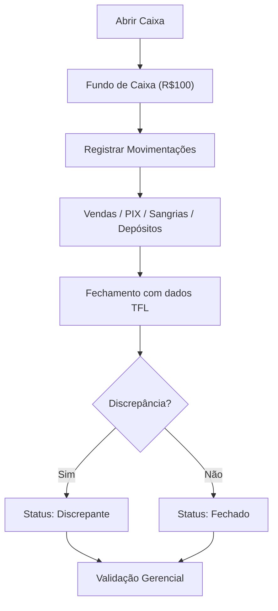

# 📦 Módulos do Sistema — Detalhamento

## 1. Dashboard / Painel Estratégico
**Rota:** `/` | **Acesso:** Admin  
**Arquivo:** `src/app/(dashboard)/page.tsx`

O painel principal mostra KPIs consolidados de todas as filiais:
- **Receitas totais** (com drill-down por categoria)
- **Despesas totais** (com drill-down)
- **Resultado líquido**
- **Gráfico de consolidação por filial**
- **Fluxo semanal**

**Status:** ✅ Funcional — Usa dados reais via `getFinanceiroAction` + mock data para drill-down.

---

## 2. Bolões & Loterias
**Rota:** `/boloes` | **Acesso:** Todos  
**Componentes:** `ModalNovoBolao`, `ModalListaBoloes`, `ModalVendaBolao`, `ModalVendaLoteBolao`, `LotteryConsolidatedCard`, `OperatorSettlementTab`, `SalesAuditTab`

Gerencia todo o ciclo de vida de um bolão:

**Regras de negócio:**
- Ágio padrão: **35%** sobre valor base da cota
- Validação: 1 a 1000 cotas, preço entre R$0,01 e R$100.000
- Concurso com no máximo 20 caracteres
- Acerto de operador: compara vendas lançadas vs cotas registradas

**Status:** ✅ Funcional — Módulo mais maduro do sistema.

---

## 3. Gestão de Caixa
**Rota:** `/caixa` | **Acesso:** Todos  
**Componentes:** `VisaoOperadorCaixa`, `VisaoGestorCaixa`, `ModalFechamentoCaixaBolao`, `AuditoriaFechamentos`, `ConsolidacaoFechamento`, `PainelValidacaoGerencial`

Fluxo completo de caixa operacional:

**Tipos de movimentação:**
- `venda`, `sangria`, `suprimento`, `pagamento`, `estorno`, `pix`, `trocados`, `deposito`, `boleto`

**Integração TFL:** O fechamento compara dados declarados vs dados do relatório TFL (Terminal Full Lotérico):
- Vendas TFL, Prêmios, Contas, Saldo Projetado, PIX QR Code

**Status:** ✅ Funcional — Com validação gerencial (admin aprova/rejeita fechamentos).

---

## 4. Financeiro — O coração do "Excel Turbo"
**Rota:** `/financeiro` | **Acesso:** Admin, Gerente  
**Componentes:** `VisaoGestor`, `VisaoOperador`, `FinancialGrowthChart`, `ModalBaixaFinanceira`, `ModalLancamentoRapido`, `ReplicarUltimoMesModal`, `CalculadoraNumerario`, `ModalFechamentoCaixa`

Este é o módulo que **substitui a planilha de despesas**. Funciona exatamente como o gestor já está acostumado — lançar valores mês a mês — mas com inteligência:

**Como funciona (Modelo "Excel Turbo"):**
1. **Cadastre categorias** uma vez (ex: Aluguel, Luz, FGTS) — elas servem como catálogo
2. **Ao lançar**, digite as primeiras letras → o sistema sugere a categoria com valor e modalidade padrão
3. **Replicar Mês** — no início de cada mês, copie todos os lançamentos fixos do mês anterior com **um clique**, ajuste os valores variáveis (luz, água) e pronto!
4. **Sem automação oculta** — nada é gerado sozinho. O gestor tem controle total

**Modalidades de despesa:**
| Modalidade | Significado | Exemplo | No banco |
|---|---|---|---|
| Fixo Mensal | Mesmo valor todo mês | Aluguel, internet, seguro | `recorrente=true, frequencia='mensal'` |
| Fixo Variável | Todo mês, mas valor varia | Luz, água, telefone | `recorrente=true, frequencia='mensal_variavel'` |
| Variável | Eventual, quando acontece | Manutenção, material | `recorrente=false, frequencia=null` |

**Funcionalidades:**
- Criar/editar/excluir lançamentos (receitas e despesas)
- Dar baixa (pagar) com comprovante e método de pagamento
- **Replicar mês anterior** com seleção de itens e valores editáveis
- Gráfico de evolução anual (receitas vs despesas)
- Exportar para CSV / Imprimir relatório
- Filtro por filial, por mês e por categoria
- Upload de comprovantes (armazenados no Supabase Storage)

**Status:** ⚠️ Funcional com correções recentes — Bug do "Salvando..." com causa raiz identificada (trigger de auditoria), correção SQL pronta para aplicar.

---

## 5. Gestão de Cofre
**Rota:** `/cofre` | **Acesso:** Admin, Gerente  
**Hook:** `useCofre`

Controla o cofre físico da lotérica — depósitos e sangrias com saldo em tempo real.

**Status:** ✅ Funcional.

---

## 6. Conciliação Bancária
**Rota:** `/conciliacao` | **Acesso:** Admin, Gerente  
**Action:** `financeiro.ts` → `getTransacoesBancarias`, `conciliarTransacao`

Compara transações bancárias com lançamentos financeiros para garantir que tudo bata.

**Status:** ✅ Funcional — Usa RPC `conciliar_transacao_bancaria`.

---

## 7. Cadastros (5 sub-módulos) — O catálogo do sistema
**Rota:** `/cadastros/*` | **Acesso:** Admin, Gerente

Os cadastros são **catálogos que alimentam todo o sistema**. Funcionam como as "tabelas de referência" que o Excel não tem:

| Sub-módulo | Rota | Função no sistema |
|---|---|---|
| **Categorias Financeiras** | `/cadastros/categorias` | Catálogo de despesas/receitas — serve de autocomplete ao lançar. Cada item tem: nome, valor padrão, modalidade (Fixo/Variável), grupo |
| Contas Bancárias | `/cadastros/contas` | Bancos e contas para conciliação bancária |
| Jogos | `/cadastros/jogos` | Tipos de loteria (Mega-Sena, Quina, Lotofácil, etc.) |
| Terminais TFL | `/cadastros/terminais` | Terminais de caixa registrados (vinculados às sessões) |
| Produtos | `/cadastros/produtos` | Produtos vendidos na lotérica (por filial) |

> **💡 Categorias = o coração do Excel Turbo.** Cadastre uma vez, use sempre. Ao lançar despesas, o sistema sugere itens do catálogo com valores e modalidades pré-preenchidos.

**Status:** ✅ Todos funcionais.

---

## 8. Painel do Operador
**Rota:** `/operador` | **Acesso:** Todos  
**Action:** `operador.ts`

Visão simplificada para o operador: seu caixa aberto, vendas do dia, metas de comissão.

**Metas de comissão:**
| Faixa | Vendas | Bônus | Nível |
|---|---|---|---|
| Bronze | R$10.000+ | R$600 | ⭐ |
| Prata | R$20.000+ | R$700 | ⭐⭐ |
| Ouro | R$25.000+ | R$800 | ⭐⭐⭐ |
| Diamante | R$30.000+ | R$1.000 | 💎 |

**Status:** ✅ Funcional.

---

## 9. Outros Módulos

| Módulo | Rota | Função | Status |
|---|---|---|---|
| Sorteios/Calendário | `/calendario` | Calendário de sorteios por jogo | ✅ |
| BI & Relatórios | `/relatorios` | Relatórios gerenciais | ✅ |
| Configurações | `/configuracoes` | Parâmetros do sistema | ✅ |
| Validação Gerencial | `/validacao-gerencial` | Admin valida fechamentos | ✅ |
| Notificações | `/notificacoes` | Alertas do sistema | ✅ |
| Produtividade | `/produtividade` | Métricas de operadores | ✅ |
| Vendedor | `/vendedor` | Painel do vendedor | ✅ |
