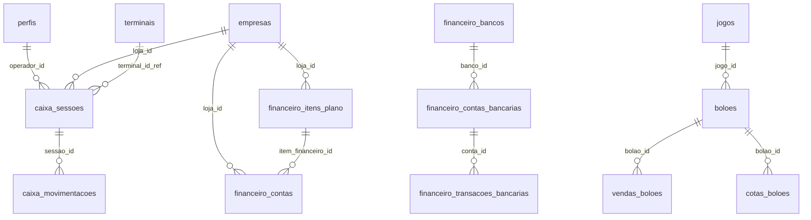

# 🗄️ Banco de Dados — Schema e Tabelas

## Visão Geral

O banco é **PostgreSQL 15** hospedado no **Supabase** (serverless). O schema usa:
- **Enums** para status e tipos
- **Row Level Security (RLS)** em todas as tabelas
- **Functions + Triggers** para automações
- **Views** para relatórios

## Tabelas principais

## Detalhamento por tabela

### 1. `perfis` — Usuários e Permissões
| Coluna | Tipo | Descrição |
|---|---|---|
| id | UUID (PK) | Referência ao `auth.users` |
| nome | TEXT | Nome do usuário |
| role | TEXT | `admin`, `gerente`, `operador` |
| loja_id | UUID (FK) | Filial vinculada |
| ativo | BOOLEAN | Se está ativo |

---

### 2. `empresas` — Filiais (Multi-tenant)
| Coluna | Tipo | Descrição |
|---|---|---|
| id | UUID (PK) | Identificador único |
| nome | TEXT | Nome da filial |
| cnpj | TEXT | CNPJ |
| endereco, cidade, uf... | TEXT | Dados de localização |

---

### 3. `financeiro_contas` — Receitas e Despesas
| Coluna | Tipo | Descrição |
|---|---|---|
| id | BIGSERIAL (PK) | ID auto-increment |
| tipo | ENUM(`receita`, `despesa`) | Tipo de transação |
| descricao | TEXT | Descrição livre |
| valor | DECIMAL(10,2) | Valor em R$ |
| item | TEXT | Nome da categoria (legacy) |
| item_financeiro_id | INT (FK) | Referência à categoria |
| data_vencimento | DATE | Quando vence |
| data_pagamento | DATE | Quando foi pago (null se pendente) |
| status | ENUM(`pendente`, `pago`, `atrasado`, `cancelado`) | Status |
| recorrente | BOOLEAN | Se é fixo mensal/variável |
| frequencia | TEXT | `mensal`, `mensal_variavel`, ou `null` |
| loja_id | UUID (FK) | De qual filial |
| usuario_id | UUID (FK) | Quem cadastrou |
| metodo_pagamento | TEXT | PIX, dinheiro, boleto, cartão |
| comprovante_url | TEXT | URL do comprovante no Storage |

---

### 4. `financeiro_itens_plano` — Catálogo de Categorias
| Coluna | Tipo | Descrição |
|---|---|---|
| id | SERIAL (PK) | ID |
| item | TEXT | Nome (ex: "Aluguel", "Luz") |
| grupo | TEXT | Grupo (ex: "DESPESAS FIXAS") |
| tipo_recorrencia | TEXT | `FIXO_MENSAL`, `FIXO_VARIAVEL`, `VARIAVEL` |
| tipo | ENUM | `receita` ou `despesa` |
| valor_padrao | DECIMAL | Valor sugerido |
| fixo | BOOLEAN | Se é fixo |
| loja_id | UUID (FK) | De qual filial |
| arquivado | BOOLEAN | Se foi arquivado |

---

### 5. `caixa_sessoes` — Sessões de Caixa
| Coluna | Tipo | Descrição |
|---|---|---|
| id | BIGSERIAL (PK) | ID |
| operador_id | UUID (FK) | Quem abriu |
| terminal_id_ref | INT (FK) | Terminal TFL |
| data_abertura / fechamento | TIMESTAMP | Horários |
| valor_inicial | DECIMAL | Fundo de caixa |
| valor_final_declarado | DECIMAL | O que o operador declarou |
| valor_final_calculado | DECIMAL | Calculado pelo sistema |
| status | TEXT | `aberto`, `fechado`, `conferido`, `discrepante` |
| tfl_vendas, tfl_premios... | DECIMAL | Dados do relatório TFL |
| status_validacao | TEXT | `pendente`, `aprovado`, `rejeitado` |

---

### 6. `caixa_movimentacoes` — Movimentações de Caixa
| Coluna | Tipo | Descrição |
|---|---|---|
| id | BIGSERIAL (PK) | ID |
| sessao_id | BIGINT (FK) | Sessão vinculada |
| tipo | TEXT | `venda`, `sangria`, `suprimento`, `pix`, etc. |
| valor | DECIMAL | Valor da operação |
| metodo_pagamento | TEXT | Como pagou |
| classificacao_pix | TEXT | Classificação do PIX |

---

### 7. `boloes` — Bolões
| Coluna | Tipo | Descrição |
|---|---|---|
| id | UUID (PK) | ID |
| jogo_id | INT (FK) | Tipo de loteria |
| concurso | TEXT | Número do concurso |
| qtd_cotas | INT | Quantidade de cotas |
| valor_cota | DECIMAL | Valor base da cota |
| agio | DECIMAL | Percentual de ágio |
| status | TEXT | `ativo`, `encerrado`, `cancelado` |

---

### 8. Outras tabelas

| Tabela | Função |
|---|---|
| `vendas_boloes` | Registro de cada venda individual de cota |
| `cotas_boloes` | Cotas geradas por bolão |
| `jogos` | Cadastro de tipos de loteria |
| `terminais` | Terminais TFL cadastrados |
| `financeiro_bancos` | Bancos cadastrados |
| `financeiro_contas_bancarias` | Contas bancárias vinculadas |
| `financeiro_transacoes_bancarias` | Transações para conciliação |
| `financeiro_parametros` | Parâmetros configuráveis |
| `cofre_movimentacoes` | Movimentações do cofre |
| `prestacoes_contas` | Prestações de contas |
| `notificacoes` | Notificações do sistema |
| `grupos` | Grupos organizacionais |
| `loja_produtos` | Produtos por filial |
| `categorias_produtos` | Categorias de produtos |

## Functions RPC ativas

| Function | O que faz |
|---|---|
| `get_anos_financeiros_disponiveis` | Lista anos com dados financeiros |
| `get_financeiro_data` | Busca transações filtradas (server action) |
| `realizar_deposito_bancario` | Registra depósito bancário |
| `conciliar_transacao_bancaria` | Concilia transação |

> **Nota:** A função `processar_recorrencias_financeiras` foi **removida** na v2.5.22 (eliminação do motor de recorrência automática).
